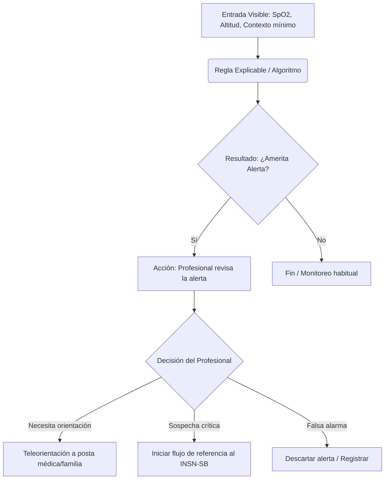
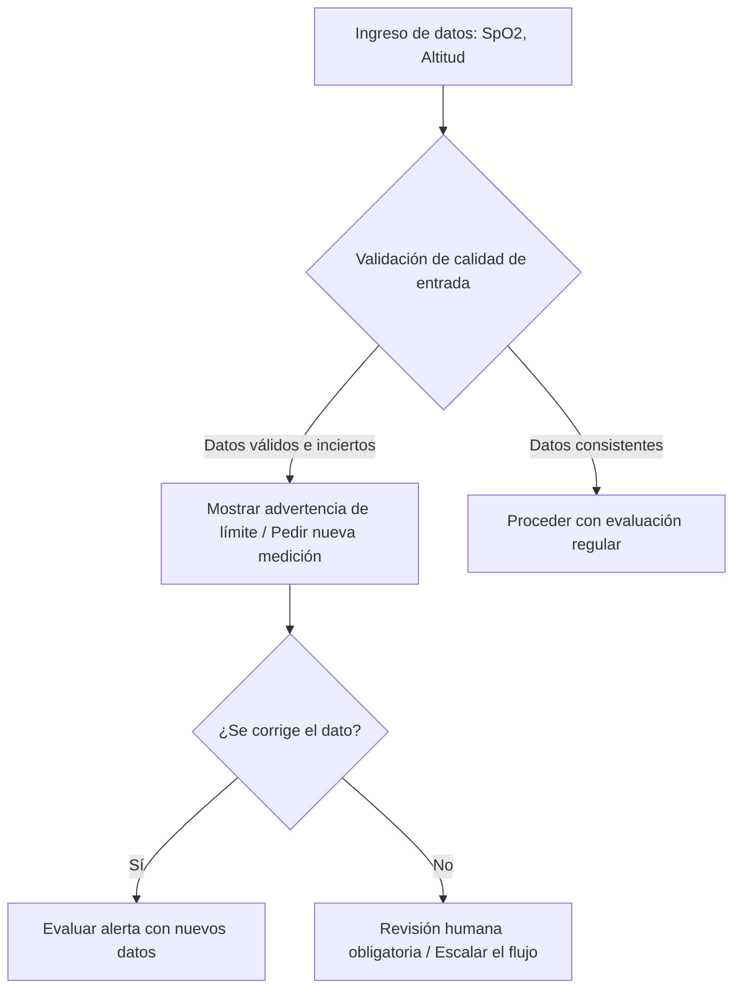

## 1. Principio fundamental: De la decisión a la acción

El valor de la Inteligencia Artificial no radica en la herramienta en sí (chatbot, predictor, recomendador), sino en cómo el resultado que genera **cambia una decisión y una acción real**.

*   **La pregunta clave de diseño:** No es "¿Dónde podemos usar IA?", sino **"¿Qué decisión queremos apoyar?"**
*   **Regla de oro:** Si no se puede escribir la decisión en una oración, la IA aún no está bien integrada al MVP (Producto Mínimo Viable).
*   **La cadena de valor:** `Problema -> Información -> Decisión -> Acción -> Seguimiento`. Un resultado solo aporta valor si activa una acción real.

## 2. Caso Guía: Cardio Alerta Perú

En el reto Cardio Alerta, el valor está en conectar el dato de entrada con la revisión, orientación y posible referencia del paciente pediátrico.

### Cadena de Valor para Cardio Alerta:
1.  **Datos mínimos:** Medición (SpO2), altitud y contexto necesario para interpretar el resultado.
2.  **Resultado (IA/Regla):** Una alerta o indicación de necesidad de revisión (no un diagnóstico automático).
3.  **Acción (Humana):** Un profesional médico revisa, brinda teleorientación y activa el flujo de referencia si corresponde.

### Momento de decisión en Cardio Alerta
Es el punto exacto donde la alerta aparece y el profesional de la salud debe decidir si revisar el caso, orientar a la familia o iniciar el proceso de referencia.

### Diagrama de Flujo (Mermaid) - Lógica visible en el MVP Cardio Alerta

## 3. Uso Responsable y Gestión de Errores (Aplicado a Cardio Alerta)

Todos los sistemas pueden fallar. El diseño debe enfocarse en cómo prevenir el daño y cómo recuperar el flujo cuando el error ocurra.

### Cadena de gestión de errores:
`Prevenir -> Detectar -> Detener -> Continuar -> Escalar`

### Ejemplo de error en Cardio Alerta (Falsa tranquilidad por entrada incierta)
Si los datos de entrada (ej. saturación o altitud) son inciertos o incompletos, el sistema **no debe** producir falsa tranquilidad.

*   **Error posible:** Validar una saturación peligrosamente baja porque la altitud ingresada fue incorrecta.
*   **Prevención:** Validar los campos de entrada y hacer visible la calidad del dato.
*   **Recuperación:** Permitir repetir la medición, corregir los datos ingresados o solicitar revisión manual.
*   **Salida segura:** Mostrar que falta información en lugar de dar un "todo está bien".
*   **Daño que se evita:** Que el paciente sea dado de alta sin la derivación oportuna.

### Diagrama de Flujo (Mermaid) - Flujo de error y recuperación en Cardio Alerta

## 4. Control Humano y Calibración de Confianza

*   **La automatización es un continuo:** Desde una IA que solo organiza información (manual), pasando por IA que sugiere (persona aprueba), hasta automatización completa (solo en casos de bajísimo riesgo).
*   **Control en el MVP:** Para Cardio Alerta (consecuencia alta), el profesional debe mantener el control. El sistema advierte, pero el médico decide.
*   **Controles visibles necesarios:**
    *   **Revisar:** Ver los datos que generaron la alerta (SpO2 y altitud).
    *   **Repetir/Corregir:** Modificar una entrada errónea.
    *   **Ignorar/Escalar:** Trazabilidad de por qué un médico decidió ignorar una alerta o derivarla a un especialista.
*   **Confianza calibrada:** El usuario no debe confiar ciegamente ni desconfiar totalmente. Debe saber que el sistema sirve para *priorizar una revisión*, no para *diagnosticar sin supervisión*.

## 5. La prueba de tres frases para el Pitch

Para explicar claramente la solución de Cardio Alerta:
1.  **Nuestra IA (o algoritmo) sirve para…** Alertar sobre posibles descompensaciones ajustando la saturación por altitud.
2.  **Puede fallar cuando…** Los datos ingresados son erróneos o el paciente presenta otras complicaciones no medidas por el oxímetro.
3.  **No debe usarse para…** Diagnosticar definitivamente una cardiopatía crítica sin la confirmación de un especialista.